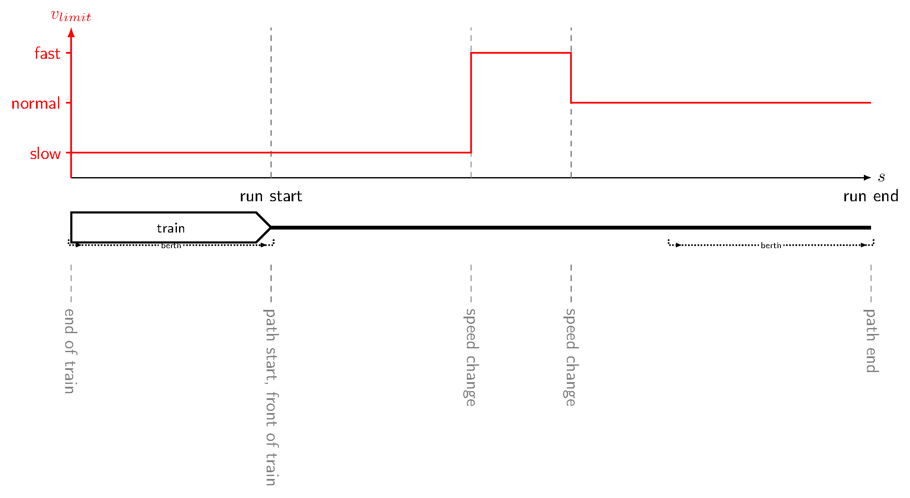
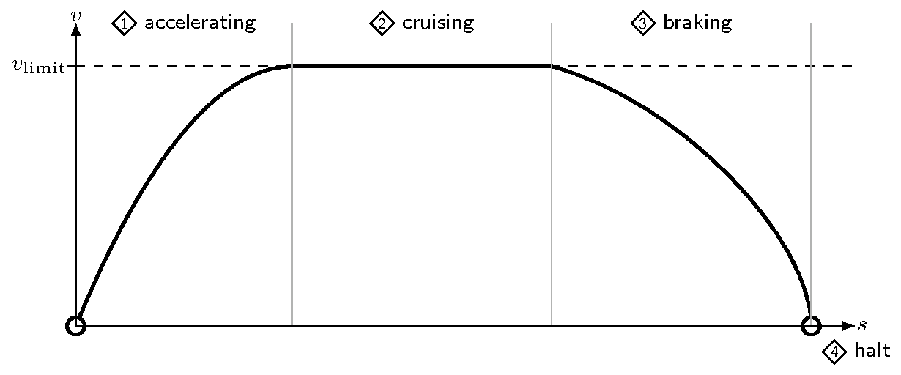

# Simple running-time calculation

## Goal

Compute the **total running time** of a train from **path start** to **path end**
under a piecewise speed-limit profile \(v_{\mathrm{limit}}(s)\), as in the path
situation below. Path start coincides with the front of the train (run start);
path end coincides with run end. The train is known only by length, \(v_{\max}\),
acceleration, and braking acceleration.

The run follows the four drive modes in the figure below — accelerate, cruise,
brake, and halt — with no timetable padding, operational dwells, or line
resistance / gradient effects.

Inputs for the train and the path must be **human-readable and editable**. After
this workflow, a reader can trust a finite total runtime (seconds) for the chosen
inputs.

## Scope

**In scope:**

> One train on one path as in A-4: speed limits only (\(v_{\mathrm{limit}}(s)\)),
> path start = front of the train / run start, path end = run end; drive cycle
> limited to modes 1–4 in A-5 (accelerate → cruise → brake → halt);
> human-editable train and path inputs; a total time that can later be
> regression-checked when the case is activated.

**Out of scope:**

> Line resistance / gradients, coasting and other advanced drive modes beyond
> A-5, custom solver tuning, timetabling, capacity, energy optimization, RailML
> import/export, interlocking, multi-train interaction, and certified ATP /
> safety models.

## Actors & systems

| ID | Actor | Type | Role | What they need |
|----|-------|------|------|----------------|
| ACT-1 | Contributor / CI | person / system | Runs and verifies the workflow | Clone + project instantiate |
| ACT-2 | Running-time calculator | package | Loads train + path, computes run | Valid train and path inputs |
| ACT-3 | Train / path data contract | data contract | Defines editable input shapes | Used on load |
| ACT-4 | Integration harness | package | Discovers the case; runs `test.jl` when active | Case assets when bound |

## Preconditions

| ID | Precondition |
|----|--------------|
| PRE-1 | A calculation approach that accepts train and path inputs is available |
| PRE-2 | Train and path inputs exist and match their data contract (when assets are added) |
| PRE-3 | When activating: expected total time (and tolerance) recorded for regression |
| PRE-4 | Trigger: contributor or CI runs the case test / package tests |

## Main scenario

| ID | Actor | Action | Data |
|----|-------|--------|------|
| STEP-1 | ACT-1 | Load train input | length, \(v_{\max}\), accel. / braking accel. |
| STEP-2 | ACT-1 | Load running-path input | path with speed limits (no resistance profile) |
| STEP-3 | ACT-2 | Compute simple running-time run | run result including total time |
| STEP-4 | ACT-1 | Read total time (and compare to reference when active) | total time |

## Artifacts

| ID | Direction | Artifact | Format / schema | Location | Notes |
|----|-----------|----------|-----------------|----------|-------|
| A-1 | input | Train | editable kinematic parameters | `assets/` (TBD) | only length, \(v_{\max}\), acceleration, braking acceleration — no mass, forces, or resistance |
| A-2 | input | Running path | editable path with speed limits only | `assets/` (TBD) | no resistance / gradient column for this case |
| A-3 | output | Total running time | seconds | calculator result | decidable value when activated |
| A-4 | illustration | Path situation | PNG (+ TeX source) | `assets/path_situation.png` | shown under Goal; path start = front of train; path end = run end; \(v_\mathrm{limit}(s)\) only |
| A-5 | illustration | Driving modes | PNG (+ TeX source) | `assets/driving_modes.png` | shown under Goal; modes 1 accelerate, 2 cruise, 3 brake, 4 halt |

## Expected outcomes

| ID | Result | Where you observe it | Pass criterion (decidable) |
|----|--------|----------------------|----------------------------|
| OUT-1 | Finite positive total running time | calculator result / future `test.jl` | `isfinite(runtime) && runtime > 0` |
| OUT-2 | Runtime matches a recorded reference | future `test.jl` | abs error ≤ agreed tolerance (set at activation) |

## Exceptions

| ID | Trigger condition | Expected behaviour | Severity |
|----|-------------------|--------------------|----------|
| EXC-1 | Missing or invalid train/path input | Fail before solve with a clear validation error | error |
| EXC-2 | Bound calculator or schema changes without updating the reference | Regression `OUT-2` fails once active | error |

## Worked example

**EX-1:** Given a train specified only by length, \(v_{\max}\), acceleration and
braking acceleration, and a path with speed-limit changes only (path start =
front of the train; path end = run end) → When the simple running-time
calculation runs (modes 1 → 2 → 3 → 4) → Then a finite positive total time in
seconds is obtained. Concrete asset files and a regression constant are added
when this case is activated.

## Verification

| ID | Given (input with values) | When | Then (expected result with values) | Verifies |
|----|---------------------------|------|-------------------------------------|----------|
| TEST-1 | A-1, A-2 available | compute run | `runtime` finite and `> 0` | OUT-1 |
| TEST-2 | Same inputs; reference constant in `test.jl` (at activation) | compare `runtime` to reference | within tolerance | OUT-2 |

**Implementation binding** (deferred until `status: active`):

- Bind `packages:` and pin Julia deps in the harness `Project.toml`
- Add versioned YAML (or other) assets under `assets/` for A-1 / A-2
- Fill `test.jl` with regression constants matching OUT-n / TEST-n

## Assumptions & limits

- Qualitative / comparative running-time use; not a certified ATP model.
- The train is kinematic only: length, \(v_{\max}\), acceleration, braking
  acceleration — no mass, tractive/braking force curves, or train resistance.
- No line resistance or gradient in the path model for this case.
- Drive cycle limited to accelerate, cruise, brake, halt (see A-5).
- Candidate calculator / schema may change before activation; keep Goal and
  Artifacts stable and record binding choices here when activating.

## Reproducibility

- When active: pin Julia and calculator compat in the harness `Project.toml`
- Version assets in this directory; no RNG expected for this workflow
- Document OS / CI notes only if they affect results

## Open questions

| ID | Question | Status | Owner | Blocking |
|----|----------|--------|-------|----------|
| Q-1 | Which concrete train and path assets should back EX-1 / TEST-n? | open | Martin Scheidt | true |
| Q-2 | Keep TrainRuns + schema as the binding, or evaluate alternatives before activation? | open | railtoolkit | true |
| Q-3 | Should schema validation also run as a separate CI step, or is load-time validation enough? | open | railtoolkit | false |

## References

- [TrainRuns.jl](https://github.com/railtoolkit/TrainRuns.jl) (candidate calculator)
- [railtoolkit/schema](https://github.com/railtoolkit/schema) (candidate data contract)
